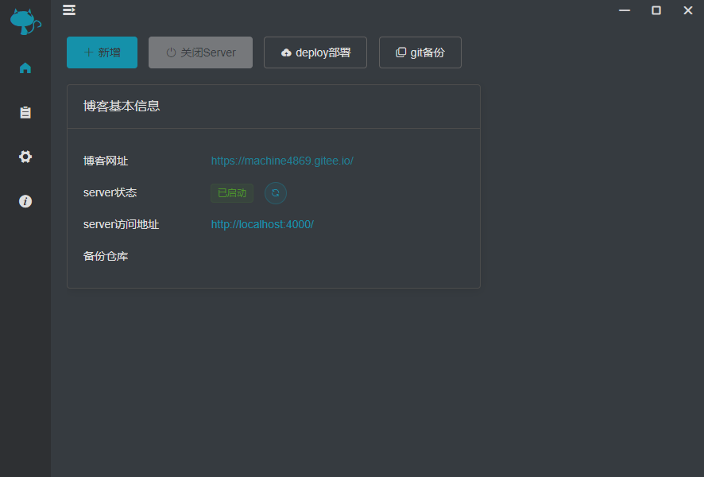
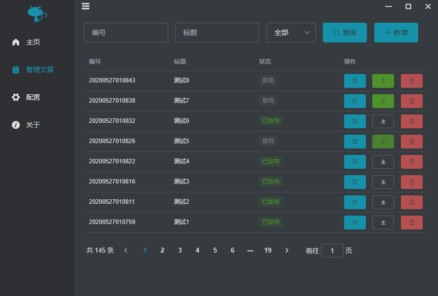

[toc]


# muf-blog-client

> Hexo桌面管理

为hexo写的桌面管理小工具，技术基于electron和vue，组件使用element ui


## 界面

使用element自定义主题，配了个暗黑模式，配色灵感来自typora的night主题。

首页



文章管理




## 功能

- 博客文章增删改查

- 启动、关闭hexo server

- 部署

- git站点备份

  

## 使用

``` bash
# install dependencies
npm install

# serve with hot reload at localhost:9080
npm run dev

# build electron application for production
npm run build
```


## 开发进度

- [ ] 主题抽取
- [x] 暗黑模式
- [ ] 主题（light/dark）可选择
- [ ] 三个平台win/mac/linux测试
- [ ] 软件更新
- [ ] 整合文章编辑功能到app
- [ ] markdown文本渲染

# 巨人的肩膀

- [electron](http://localhost:9080/#)
- [Vue.js](http://localhost:9080/#)
- [element-ui](http://localhost:9080/#)

